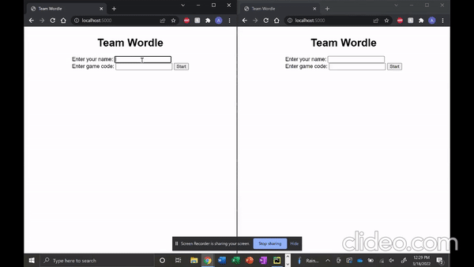

# Team-Wordle 🤝
Take turns with a partner to play Wordle!

## Technologies Used

This app uses Flask for web development and Flask-SocketIO for low latency, bi-directional communication between the server and its (potentially multiple) clients. Using Flask-SocketIO allows for easy transmission of data from the server to relevant clients by emitting custome events. I could then define the necessary client-side and server-side behavior in the case of these events.

## Running this project

Run this project by executing `python main.py` in the project directory. This project uses Flask & Flask-SocketIO. These
requirements are listed in the `requirements.txt` file. Run `pip install requirements.txt` to install them.

## How to play

* When you open up the webpage, you will first be prompted to enter your name and a game code. 
  * If you'd like to start a game from scratch, you can skip the game code and click the start button. 
  * If you'd like to join an existing game, enter the game code from the existing game and click the start button. 
    * If the code doesn't exist or the game is already full, you will be directed to a new game. 
* Once both players are connected in the game, take turns guessing the word. 
  * Use your keyboard to make your guess and press the enter key to submit your guess.
  * Player 1 will make the 1st, 3rd, and 5th guesses.
  * Player 2 will make the 2nd, 4th, and 6th guesses. 
  * If a tile turns yellow, the letter is in the word but in the wrong position. 
  * If a tile turns green, the letter is in the word and in the correct position. 
* Good Luck ☘️

## Example

## Next Steps

* Allow users to restart their game after finishing and keep track of their team streak. 
* Improve styling.
